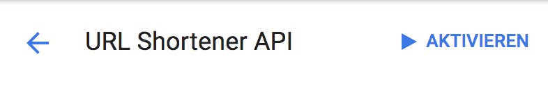

# Geist Server

## Details
This is the server side of `Geist`.
Powered and hosted by [`Firebase`](https://firebase.google.com/).

## Setup
Before you start you have following these simple steps to setup `Geist Server` correctly.

1. Create the Firebase Project
2. Activate E-Mail/Password registration method

3. Restrict the browser key. Go to the [Google API Console](https://console.developers.google.com/apis) and select the browser key.

4. Enable only your Firebase Project domains.

5. (Optional but recommended) Enable Goo.gl Shortener API.

> **Note:** For the first time you are finish here.
[Deploy](#deploy) the App and execute `Geist` client. Follow the steps on [Geist - creating a User](https://github.com/stefma/Geist).
6. (Optional but recommended) Restrict your created user.

7. (Optional but recommended) Set storage permissions.

## Deploy

#### Credentials
Copy the credentials from your Firebase Project into the [`firebase_base.js`](js/firebase_base.js).

See [`Add Firebase to your Project`](https://firebase.google.com/docs/web/setup).

#### Upload to Firebase
After you have installed the Firebase CLI tool

`npm install -g firebase-tools`

You can just run

`firebase deploy --project $YOUR_🔥BASE_PROJECTID`
