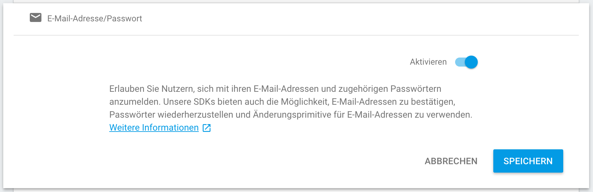
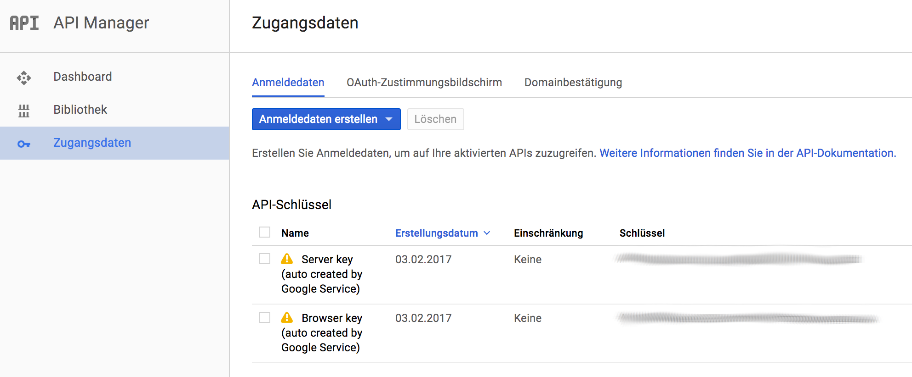
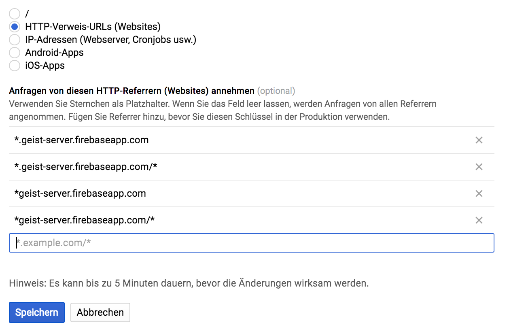
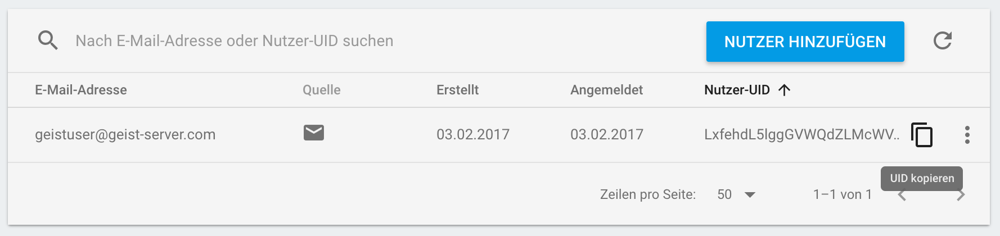
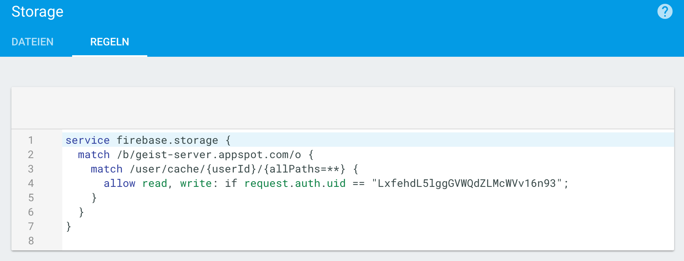

# Geist Server

## Details
This is the server side of `Geist`.
Powered and hosted by [`Firebase`](https://firebase.google.com/).

## Setup
Before you start you have following these simple steps to setup `Geist Server` correctly.

1. Create the Firebase Project
2. Activate E-Mail/Password registration method

3. Restrict the browser key. Go to the [Google API Console](https://console.developers.google.com/apis) and select the browser key.

4. Enable only your Firebase Project domains.

5. (Optional but recommended) Enable Firebase Dynamic Links. First you need to go to the dynamic links section in your Firebase console and create a new domain prefix (`*.page.link` are free to use).
Then you have to addd the domain prefix to the `linkInfo.domainUriPrefix` variable inside the [`shortener.js`](js/shortener.js) 
> **Note:** For the first time you are finish here.
[Deploy](#deploy) the App and execute `Geist` client. Follow the steps on [Geist - creating a User](https://github.com/stefma/Geist).
6. (Optional but recommended) Restrict your created user.

7. (Optional but recommended) Set storage permissions.

## Deploy

#### Credentials
Copy the credentials from your Firebase Project into the [`firebase_base.js`](js/firebase_base.js).

See [`Add Firebase to your Project`](https://firebase.google.com/docs/web/setup).

#### Upload to Firebase
After you have installed the Firebase CLI tool

`npm install -g firebase-tools`

You can just run

`firebase deploy --project $YOUR_🔥BASE_PROJECTID`

## Update/Release

### Version
If we update the server it is mandatory to update the [version](version) file.

The version number should follow [these](http://semver.org/) specs.

The name is just a random name and will be generated with [this](http://www.codenamegenerator.com/) tool.
Don't use a prefix and suffix. The dictionary should point to `US Countries`

### GitHub Release
After we published we have to create a [GitHub Release](https://github.com/StefMa/Geist-Server/releases).

For that we needed a tag which will be named as `release/vX.X.X`.
The X.X.X represent the version we specified with the step above.

It is also necessary to add a changelog.
